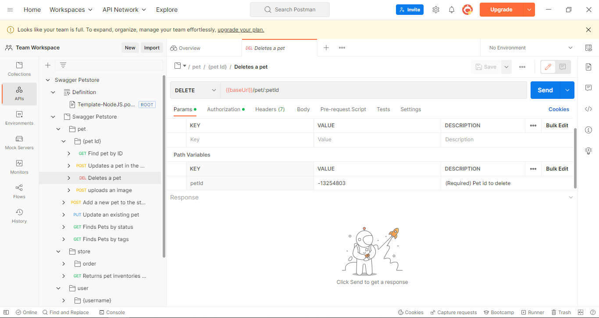

# Swagger

Fecha de comienzo: 03 de Noviembre del 2022
Fecha de terminado: 

Autores:
 - @reynaldoverdugomacropay

## 1 TL;DR

<!--
párrafo corto que explica qué estas proponiendo
-->
Agregar en nuestras API's un framework| herramientas para documentarlas mediante una investigación.

## 2 Motivación

<!--
¿qué motiva esta decisión y por qué es importante?
el propósito de esta sección es articular de una manera sencilla el valor de la decisión que vamos a tomar
-->

Nuestra empresa se encuentra en constante crecimiento creando o actualizando API's. Por lo tanto, al documentarlas, tendremos las siguientes ventajas:

  - Entendimiento de cada una de nuestras API's.
  - Mejor toma de decisiones y ahorro de tiempos en productividad, ya que al conocer nuestras API's podemos re-utilizarlas siempre y cuando se el caso.
  - Mejora de tiempos de productividad en el área de Middleware, ya que cualquier pregunta, duda pueden consultar a la documentación del API.
  - Interfaz gráfica amigable para que las áreas externas puedan entender con facilidad.

## 3 Propuesta de implementación

<!--
Este es el núcleo de tu propuesta, y su propósito es ayudarte a pensar en la solución. Esto debe ser un wireframe, no un documento perfecto con todos los detalles.

Escribir es pensar https://medium.learningbyshipping.com/writing-is-thinking-an-annotated-twitter-thread-2a75fe07fade

  - usa diagramas para ilustrar tus ideas o flujos
  - incluye ejemplos de código si estas proponiendo una interfaz o contrato de sistemas nuevo
  - agrega links con las especificaciones de proyectos

El propósito de esta sección se resume en:
"Esta es la dirección en la que nos voy a llevar, alguien ve huecos en mi propuesta o tiene comentarios sobre cómo mejorarla?

 -->
 
Actualmente se cuentan con templates para diferentes tipos de proyectos dependiendo del requerimiento y lenguaje o de la forma que se requiere el despliegue en aws.
  - Basado en eso templates se pueden modificar para incluir la documentación con la api/libreria que se necesite dependiendo del caso.
  - Hay templates basados en lenguajes diferentes como lo son: NodeJs, Php, Java; Phyton, C#
  - Al igual que documentar las apis, habría que poner información en el readme para que el equipo de DevOps pueda realizar despliegues sin detalle alguno.

Las propuestas para el uso de la documentación dentro de los proyectos en desarrollo se encuentran: 
  - Swagger: Es una serie de reglas, herramientas y especificaciones que ayudan con la documentación de las apis. Esta permite crear una documentación bastante completa para que el resto de los integrantes del equipo puedan entenderla.
  Maneja una interfaz grafica que permite visualizar las apis, así como los comentarios y hacer pruebas para ver el funcionamiento de las mismas. Así mismo muestra que mensajes puede mostrar en diversos tipos de caso. Funciona generando una sanbox con la definición a partir del swagger.json pero haciendo la conversión primero desde Swagger.yaml

      - Url: https://swagger.io/
      - Roles:
          - Customers: Son los que tienen acceso a la documentación y pueden probar las funciones de la Api.
          - Designers: Son los que pueden crear, editar, comentar en la Api, en pocas palabras son los colaboradores del proyecto.

  La propuesta cuenta con varias Ventajas:
   -  Es de las más utilizadas.
   -  Es compatible con node Js.
   -  Si es Node Js es gratis el uso de swagger.
   -  La interfaz permite ver parte del código, así como es muy amigable para el usuario.
   -  Permite ver los métodos de ingreso de datos y ver que recibe y que envía.
   -  Permite versionado de Apis.
   -  Swagger es compatible con postman, esto es posible debido que al crear la UI de swagger se genera un link donde se puede descargar un archivo JSON que es  compatible con POSTMAN, lo cual facilita las pruebas locales.
        

El Swagger se expondría en la ruta del API mediante "/docs" en los proyectos anteriores, futuros hechos con Node JS.
## 4 Métricas

<!--
¿Qué métricas debemos vamos a instrumentar, o monitorear para observar las implicaciones de esta decisión?
¿Por ejemplo, cuando interactuamos con un sistema externo que tipo de latencia esperaríamos o si agregamos una tabla nueva que tan rápido se llenaría?
-->
Uno de los grandes inconvenientes es que los aplicativos y requerimientos están hechos en diferentes lenguajes, la opción de centralizar dichos proyectos llevaría mayor tiempo del que se dispone para cada proyecto. Para ello la propuesta de centralizar en un solo tipo de lenguaje se vería beneficiada para los aplicativos nuevos, ya que esto facilitará mucho la comprensión de los proyectos, mientras que los que ya están en producción se podría mantener como están hasta que se les permita hacer un rediseño, adaptándolo a las nuevas tecnologías que se están implementando y al marco de trabajo.

Parte de los proyectos anteriores hechos antes del cambio realizado por la empresa, presentan un tiempo de respuesta algo lento, pero se habla de proyectos grandes que ya están siendo usados por el usuario final, lo cual hacerle un rediseño por el momento no es conveniente, por lo cual la propuesta seria bienvenida por los nuevos aplicativos. Y los aplicativos que ya cuenten con el marco de trabajo actual.

Tiempos de Entrega sin documentacion.
  - El front tiene que ir con su lider a preguntarle el API. ( 1 hora )
  - El líder tiene noción del API, pero como no es su area, lo consultaría con una persona de Middleware para pedir el apoyo. ( 2 horas )
  - Se arma una sesión para explicarle el API ( 2 horas )
  - El Front se pone a programar, pero tiene mas dudas acerca de un endpoint y vuelve a consultar al programador Middleware (1 hora).
  - El Front desconoce las variables que debe enviar al endpoint, por lo que le vuelve a consultar al middleware(1 hora)
  - El Front tambien necesita conocer como recibira los datos y debe consultar al middleware(1 hora)
  - El Front luego necesita actualizar su Json en caso de que el endpoint lo requiera y debe consultar la estructura con el middleware(1 hora)
  - El Front debe ajustarse a los mensajes de error que devuelva la api, necesita consultar al middleware nuevamente(1 hora)

Tiempos de Entrega con documentacion:
  - El front tiene que ir con su lider a preguntarle el API. ( 1 hora )
  - El Front tiene la posibilidad de consultar la documentacion(2 horas)
  - El Front necesita adaptarse a los nuevos cambios pero puede consultar el Json que genera el Endpoint(1 hora)

La Productividad contando con una base de 100 horas de desarrollo de un proyecto como ejemplo seria de la siguiente manera
|  | Horas de Consulta | Productividad  |
| :---:  |  :---:  | :---: |
| Sin Documentacion   | 10 horas|90%|
| Con Documentacion   | 4 horas|96%|

## 5 Riesgos e inconvenientes

<!--
¿Hay razones por las que no deberíamos hacer esto?
¿Qué riesgos estamos tomando? Por ejemplo, no tenemos experiencia con esta tecnología nueva o no entendemos la escala aún.
-->
A su vez la propuesta con ciertas desventajas:
- No es compatible con muchos lenguajes
- Al no ser compatible con Swagger un lenguaje es necesario hacer uso de SwaggerHub el cual tiene un precio.
- Solo da 14 días gratis de uso de SwaggerHub
- Para tener más colaboradores se debe ampliar el plan que se paga por mes
- Los empleados no conocen del todo esta nueva tecnología
- No se cuentan con plantillas donde se implemente.
- Un cambio grande en la manera de manejar los proyectos
- Hay proyectos ya hechos y que se encuentran en producción que hacerles cambio requeriría hacer despliegues nuevamente.

Los costos aplican para SwaggerHub, cuando se intente implementar en un lenguaje que no soporte.
Costos:
Por Mes:
  -  $90 USD/Mes: 3 Designers/6 Consumers
  -  $150 USD/Mes: 5 Designers/10 Consumers
  -  $300 USD/Mes: 10 Designers/20 Consumers
Por Año:
  -  $75 USD/Mes: 3 Designers/6 Consumers
  -  $125 USD/Mes: 5 Designers/10 Consumers
  -  $250 USD/Mes: 10 Designers/20 Consumers

## 6 Alternativas
Para poder llevar a cabo la tarea de la documentación de aplicaciones tenemos diferentes alternativas que pueden cubrir las funciones que Swagger realiza.

- RAML: Lenguaje de definición para apis que se basan en http, una aplicación del formato YAML 1.2, el cual facilita la documentación de api Rest y las mantiene sincronizada. Proporcionando la información necesaria para poder describir las API RESTful/ RESTful, fomentando la reutilización de código.
    - Url: https://raml.org/

- Oracle+Apiary: Al igual que Swagger esta es una alternativa bastante llamativa, funciona de la misma manera, pero teniendo en cuenta que está ligada con oracle. donde se pueden visualizar más de un proyecto, y cuenta con conexión a github.
    - Url: https://apiary.io/
- FastApi: Un api de de python que facilita la codificación, así como la documentación minimizando incluso la duplicación de código dentro del proyecto. Esta debe instalarse directamente en los proyectos python para poder hacer uso de ella, además de ir a la par con node js.
    - Url: https://fastapi.tiangolo.com/es/

<!--
¿Hay otras formas de resolver este problema?
-->

## 7 Impacto potencial y dependencias

<!--
 ¿Qué otros sistemas se verán afectados con esta propuesta?
 ¿Qué consideraciones de seguridad debemos tener? 
 ¿Como pueden explotar esta parte del sistema?
 ¿Qué impacto tiene esta decisión sobre soporte al cliente?

  Aquí buscamos ser conscientes del ambiente en el que operamos y generar empatía hacia otros que pueden verse afectados por nuestra decisión.
 -->

- RAML:
    - Ventajas:
        - Proporciona documentación interactiva.
        - compatible con Node Js y Php.
        - Permite tener el control en la documentación.
        - Es de código abierto.
        - Tiene soporte sólido.
        - Fomenta la reutilización de código.
        - Permite el descubrimiento de mejores prácticas de codificación.
        - Permite centrarse directamente en el "contrato" que ofrece el endpoint.
        - La metodología que emplea permite facilitar el testing aportando el entorno perfecto para usar TDD.
        - Puede convertir su especificación a OPENAPI(Swagger).

    - Desventajas:
        - Lenguaje es tipo mobile
        - No compatible con muchos Lenguajes.
        - Documentación completamente en inglés.
        - No todos los proyectos están hechos con html, php o Node JS.
        - Los programadores no utilizan siempre la misma tecnología en los requerimientos.

- Oracle+Apiary:
    - Ventajas:
        - Conexión con github.
        - sincronización de proyectos con github.
        - Permite el uso gratuito de manera ilimitada, pero está restringido con ciertas características.
        - Permite controlar quienes son colaboradores y quienes solo pueden visualizar.

    - Desventajas:
       - Actualmente la compra de planes es confusa.
        - Los planes de pago que manejaba están obsoletos.
        - Se tiene que comprar una suscripción a Oracle Cloud.
        - El modo gratuito solo permite 5 editores y 10 viewers
        - No compatible con muchos Lenguajes
- FastApi:
    - Ventajas:
        - Documentación en diferentes idiomas incluyendo español
        - Ayuda a crear código para producción con documentación interactiva.
        - Previene más los errores humanos.
        - Fácil de usar.
        - Intuitivo.
        - Basado en estándares como Swagger.

    - Desventajas:
        - Esta api/librería solo es para python
        - No todos los proyectos están hechos en phyton.
        - Los desarrolladores deberán acostumbrarse a este nuevo marco de trabajo.
        - Podría retrasar los proyectos cuando el desarrollador no conozca de este lenguaje.

- Comparación de Precios

| Tipo   | De Paga? | Mensual  | Anual | Panel | Cloud? | Comentario |
| :---:  |  :---:  | :---: | :---:  |  :---:  | :---: | :---: |
| Swagger |   ❌    |  Free  |   Free  |   ❌   |    ❌   | Al ser solo Swagger no tiene costo |
| Swagger Hub |    ✔    |  Planes de $90, $150, $300 USD  |   Planes de $75, $125, $250 USD  |   ✔   |    ✔   | Dependiendo del plan es la cantidad de Designers y Consumers y el mas completo para documentacion y facilidad de pruebas, Los costos aplican para swagger hub |
| RAML  |    ❌    |   Free   |   Free   |    ❌    |    ❌    | No cuenta con un panel administrativo de las api, código abierto|
| APIARY |   ❌ Obsoleto   |  Free  |   Free  |   ✔   |    ✔   | Esta gratuito pero está limitado con muchas cosas|
| FASTAPI  |    ❌    |   Free   |   Free   |    ❌    |    ❌    | No cuenta con un panel administrativo de las api|

## 8 Preguntas sin resolver

<!--
¿ Qué preguntas no hemos resuelto?
-->
  - ¿Estamos dispuestos a manejar diferentes tipos de documentación si se trata de aplicativos que sean incompatibles con la propuesta?
  - ¿Que sucederá con los proyectos previos?
  - ¿Se usará una misma estructura?

## 9 Conclusión
En conclusión, la opción viable es Swagger para el manejo de la documentación de las API Rest, debido a que pese a los costos nos facilita y brinda soluciones, al implementar solo Swagger no tendría ningún costo, además al contratar Swagger Hub esto nos permitirá que en las configuraciones se le pueda proporcionar al equipo de QA los roles de Consumers para poder realizar pruebas, mientras que al equipo de desarrollo se le otorga el de Designers. También porque el panel que maneja es el que permite realizar pruebas directamente con lo que se tiene. Permite el versionado de las aplicaciones, también de ser el más estandarizado de todos, ya que la gran mayoría de librerías/apis se basan en este como un estándar. 

Es factible el uso de esta herramienta, a pesar de las desventajas que pueda haber utilizado Swagger, que se puede solucionar con Swagger Hub nos da más beneficios porque nos proporciona control sobre los proyectos. Y al ofrecer un sistema de roles esto permite tener mayor seguridad sobre nuestros desarrollos. Aparte de contar con la documentación en español, lo cual es conveniente, ya que no todos tienen un inglés fluido. Swagger es bastante conveniente, ya que varios líderes de proyectos han trabajado con Swagger con anterioridad y esto permitiría centralizar y estructurar bien el manejo de la documentación con el resto de los programadores.

Porque Swagger y no RAML, Swagger cuenta con Swagger Hub que es el que permite realizar pruebas de las aplicaciones seleccionando el proyecto, así como tiene una documentación sólida a comparación de RAML, cuenta con una comunidad bastante activa para la base de apoyo. Cuenta con un soporte casi nulo para las nuevas versiones, además de contar con una gran ventaja sobre RAML, ya que está diseñado como una especificación de abajo hacia arriba, mientras que RAML es todo lo contrario sobresaliendo sobre el ciclo de vida del api, mientras que Swagger especifica que comportamiento afecta a nuestra api a la hora de crear sistemas entrelazados y complejos. Al igual que la interfaz gráfica de Swagger permite tener un mejor control sobre los proyectos. Aparte de que Swagger soporta documentaciones robustas mientras que RAML no puede.
